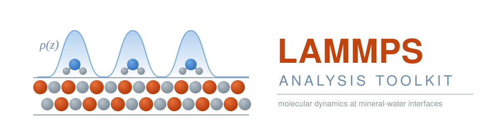

<p align="center">
  
</p>

Python tools for preparing and analysing LAMMPS molecular dynamics
simulations of mineral-water interfaces.

## About

I work on classical MD of mineral surfaces in contact with water and
dissolved ions. The same tasks come up in every project: checking an input
script before it reaches the queue, getting trajectories into the right
format, then measuring how water and ions are structured near the surface.
These are the tools I use, cleaned up and documented so they are useful to
someone else.

Each script runs standalone from the command line and works on any LAMMPS simulation, not just the systems I study.

## Tools

| Script | Purpose | Status |
|---|---|---|
| `lammps_check.py` | Validate an input script before submitting it | Available |
| `dcd_to_dump.py` | Convert DCD trajectories to LAMMPS dump format | Available |
| `thermo_analysis.py` | Averages, drift and plots from a thermo log | Planned |
| `density_profile.py` | Density of water and ions along the surface normal | Planned |
| `rdf.py` | Radial distribution functions | Planned |
| `msd.py` | Mean squared displacement and diffusion coefficients | Planned |
| `hydrogen_bonds.py` | Hydrogen bond counting and lifetimes | Planned |

Everything above follows the same workflow: check the input, run the simulation, convert the trajectory, then analyse the log and the structure.

## Installation

```bash
git clone https://github.com/abir-boublia/LAMMPS-Analysis-Toolkit.git
cd LAMMPS-Analysis-Toolkit
pip install -r requirements.txt
```

Requires Python 3.10 or newer. `lammps_check.py` uses only the standard library and needs no installation at all.

---

## lammps_check.py

Checks a LAMMPS input script before you submit it.

Most failed jobs die in the first seconds for reasons already visible in the
input: a misspelled command, a data file that is not where the script says it
is, a group used before it is defined, a coefficient missing for a declared
type. Each one costs a queue wait. This reads the input, follows its include
files, reads the header of the data file, and reports anything inconsistent
between the three.

```bash
python scripts/lammps_check.py in.lammps
```

It also prints a summary of what the simulation actually does:

```
  units          real
  system         17,373 atoms, 9,182 bonds, 5,311 angles
  types          6 atom types, 2 bond types, 2 angle types

  3 stages, 11,000,000 dynamics steps total
  1  minimisation   min_style cg
  2  NPT            300.0 K, 1.0 atm
                     1 fs x 1,000,000 steps = 1 ns
                     constraints: shake on group water
                     dump a -> equil.dcd, every 1,000 steps (1,000 frames)
  3  NVT            300.0 K
                     1 fs x 10,000,000 steps = 10 ns
                     dump a -> prod.dcd, every 1,000 steps (10,000 frames)
```

**What it reports as errors**, meaning the job will not run:

- Misspelled commands and `thermo_style custom` keywords, with suggestions
- `read_data`, `include` or `read_restart` files that do not exist
- Groups used before they are defined
- Missing `mass`, `pair_coeff`, `bond_coeff` or `angle_coeff` for types the
  data file declares
- An interaction style missing while the data file declares that interaction
- `unfix`, `undump` or `uncompute` of an ID that was never created
- A fix redefined with a different style while still active, which is usually
  a missing `unfix` after an earlier run
- Type numbers beyond those the data file declares, including in `fix shake`

**What it reports as warnings**, meaning it runs but may not do what you meant:

- `read_data` before any `units` command, where LAMMPS falls back to lj units
- Duplicate fix IDs, and more than one time-integration fix active at a run
- `kspace_style` with a pair style that has no long-range Coulomb term
- Log and trajectory sizes, when a `thermo` or `dump` interval would produce
  an unreasonably large file

Exit code 1 on errors, so it works as a gate in a submission script:

```bash
python scripts/lammps_check.py in.lammps || exit 1
srun lmp -in in.lammps
```

Run it from the directory holding the input, since file paths resolve
relative to the script that names them.

---

## dcd_to_dump.py

Converts a DCD trajectory into a LAMMPS text dump.

I run production simulations dumping to DCD because it is compact, then
regularly need the same trajectory in OVITO for visualisation. Converting
by hand every time got old, so this does it in one command and handles the
two things that break silently along the way: the box origin, which DCD
does not store, and triclinic cells.

```bash
python scripts/dcd_to_dump.py topology.lmp trajectory.dcd output.dump
```

| Argument | Meaning |
|---|---|
| `topology.lmp` | LAMMPS data file (`.data`, `.lmp`, any name): atom types, bonds, box |
| `trajectory.dcd` | DCD trajectory to convert |
| `output.dump` | File to write |

Useful options:

```bash
--step 10          convert every 10th frame
--start / --stop   restrict the frame range
--atom-style       column layout of the data file Atoms section
--anchor           whether an NPT box grows about its centre or lower corner
```

Run with `--help` for the full list.

**A note on NPT runs.** Under constant pressure the cell breathes, and LAMMPS
expands the box about its centre. The default `--anchor center` accounts for
this. If your atoms end up outside the box bounds, try `--anchor lo`.

## License

MIT. See [LICENSE](LICENSE).
